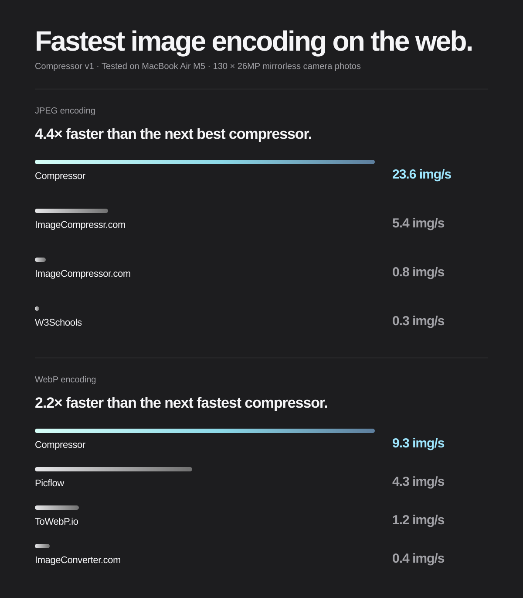

# Compressor

[Compressor](https://ashcx.github.io/image-compressor-v1/) is a speed-first browser image compressor for converting, resizing, and processing images in batches.

It uses adaptive background workers to process independent images in parallel while keeping the interface responsive. JPEG, PNG, WebP, AVIF, and HEIC are supported, with format-specific quality controls and batch downloads.

[Open the live app](https://ashcx.github.io/image-compressor-v1/)

## Why Compressor?

- **Fast batch processing.** Independent images are processed concurrently, with worker capacity adapted to the device and selected codec.
- **Responsive while it works.** Decoding, resizing, estimating, and encoding run away from the UI thread.
- **One focused workflow.** Select images, choose an output format, review estimates, compress, and download.
- **Useful at scale.** Virtualized results and bounded output storage keep large batches manageable instead of mounting every row or retaining every result in the page.
- **No upload required.** Image processing happens locally in the browser; image bytes are not sent to a server.

## How to use it

1. Open the app and choose **Select images**, or drop images onto the drop area.
2. Choose the output format and adjust its options.
3. Review the estimated sizes. For several files, select **Compress all**.
4. Download individual results, download the batch as a ZIP, or use **Save to folder** where the browser supports it.

Estimates are guidance, not a guarantee. Final size depends on image content, dimensions, selected settings, and the browser codec.

## Output formats

| Format | Best for | Important details |
| --- | --- | --- |
| JPEG | Photographs and broad compatibility | Lossy; does not preserve transparency |
| PNG | Screenshots, graphics, and transparency | Native lossless mode by default; slower lossless and lossy modes are available |
| WebP | A strong general-purpose web format | Usually smaller than JPEG at similar visual quality; offers default WASM and slower native-browser size modes |
| AVIF | Very small modern web images | Strong size potential, but encoding is slower and browser support is newer |
| HEIC | Apple-ecosystem compatibility | Uses a portable WebAssembly codec for consistent output; encoding is slower |

Compression is not guaranteed to reduce size. Some images and settings can produce an output larger than the original.

## Fast and furious


** Exact speed may differ between client hardware, as compression is done on-device and varies by system memory and CPU performance.  

Compressor uses batch-level parallelism: each worker processes an independent image while the main thread remains available for painting and input. The worker pool is sized from available device signals and reduced for memory-heavy codecs.

Common formats use native browser encoders where they are the best option. WebP defaults to libwebp WebAssembly encoding due to its faster speed with few tradeoffs and offers an opt-in smaller-size mode using the native browser encoder when available. WebAssembly codecs provide portable paths for formats and browser combinations that do not have a suitable native encoder. Codec modules are loaded lazily, so selecting JPEG does not pay the startup cost for AVIF or HEIC.

The application also limits decoded image memory, samples large batches for estimates, virtualizes the results list, and stores completed outputs outside the active job state when the browser provides the Origin Private File System. These controls are intended to improve throughput without making the page unusable on constrained devices.

The committed benchmark references include 500- and 1,000-file synthetic cohorts. They are useful for regression comparisons, not guarantees for every device. Absolute speed depends on the browser, processor, memory bandwidth, image dimensions, and selected format.

## I don't spy with my little eye

The conversion pipeline runs in the browser using Web Workers, WebAssembly, and native browser image encoders. The application does not send selected image bytes to a server; the hosting service only delivers the app's static files.

The core workflow is intended for recent desktop and mobile versions of Chrome, Firefox, and Safari. Browser capabilities differ, especially for AVIF, HEIC, large batches, folder saving, and available memory. ZIP download is the compatibility fallback when folder saving is unavailable.

HEIC/HEIF input is decoded natively where the browser supports it and through WebAssembly otherwise. HEIC output uses the WebAssembly encoder. The app does not edit, crop, watermark, catalogue, or store an image history.

## For developers

Requirements: a current Node.js release and npm.

```sh
npm ci
npm run dev       # start local development
npm test          # run unit tests
npm run lint      # check formatting and static rules
npm run typecheck # check TypeScript
npm run build     # typecheck and create the production build
npm run preview   # serve the production build locally
npm run benchmark # run the Playwright browser benchmarks against the build
```

The project is a Vite + TypeScript + Preact application. GitHub Pages deploys the build from `main` through `.github/workflows/pages.yml`.

The main source areas are:

- `src/App.tsx` — application state and user interface
- `src/lib/` — format detection, estimates, device limits, downloads, and ZIP handling
- `src/lib/codecs/` — native and WebAssembly codec selection
- `src/workers/` — decode, resize, estimate, and encode work away from the UI thread
- `src/lib/*.test.ts` — unit tests for the non-UI modules
- `bench/` — Playwright benchmark harness, fixture generator, and committed baselines

## Further documentation

- [Architecture](./docs/ARCHITECTURE.md) — processing pipeline, design choices, and trade-offs
- [Performance and memory](./docs/PERFORMANCE_AND_MEMORY.md) — measured encode times, output sizes, memory model, worker scaling, and estimate accuracy
- [Benchmark harness](./bench/README.md) — how to run and compare browser benchmarks
- [QA matrix](./docs/TEST-MATRIX.md) — test corpus, browser/device matrix, and release checks
- [HEIC decision](./docs/HEIC.md) — decoder/encoder feasibility, licensing, and security
- [Scrum TODO roadmap](./docs/TODO.md) — sprint backlog, story points, acceptance criteria, and HEIC delivery work

## Known limitations

- Browser memory limits constrain very large images and batches.
- Output orientation is normalized into the pixels, but EXIF, GPS, XMP, ICC, depth maps, burst frames, and auxiliary images are not preserved; only the primary still image is converted.
- AVIF and some PNG modes can be substantially slower than JPEG or WebP.
- Folder saving requires a browser File System Access API; otherwise use the ZIP download.
- A ZIP stores image bytes without attempting to recompress them, so its size is close to the combined output files plus ZIP metadata.
- Animated GIF, TIFF, and SVG are not current output targets.
